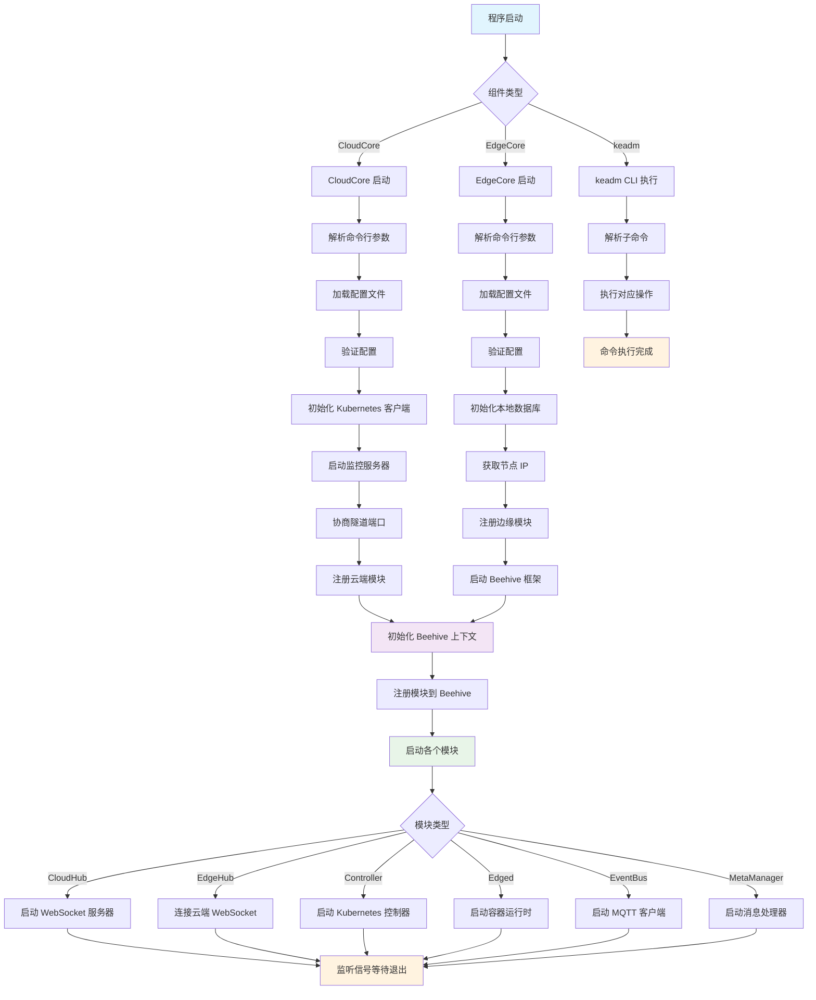

# KubeEdge 程序入口与启动流程

## 主要入口函数

### 核心组件入口文件

| 组件 | 入口文件 | 主函数位置 | 说明 |
|------|----------|------------|------|
| **CloudCore** | `cloud/cmd/cloudcore/cloudcore.go:27` | `func main()` | 云端核心组件，包含 CloudHub、EdgeController、DeviceController |
| **EdgeCore** | `edge/cmd/edgecore/edgecore.go:11` | `func main()` | 边缘端核心组件，包含 EdgeHub、Edged、MetaManager 等 |
| **keadm** | `keadm/cmd/keadm/keadm.go:25` | `func main()` | 集群管理工具，用于初始化和管理 KubeEdge 集群 |

### 其他组件入口文件

| 组件 | 入口文件 | 主函数位置 | 说明 |
|------|----------|------------|------|
| **Admission** | `cloud/cmd/admission/admission.go` | `func main()` | 准入控制器 |
| **ControllerManager** | `cloud/cmd/controllermanager/controllermanager.go` | `func main()` | 控制器管理器 |
| **CSIDriver** | `cloud/cmd/csidriver/csidriver.go` | `func main()` | CSI 驱动 |
| **IptablesManager** | `cloud/cmd/iptablesmanager/iptablesmanager.go` | `func main()` | iptables 管理器 |
| **EdgeMark** | `edge/cmd/edgemark/hollow_edgecore.go` | `func main()` | 边缘标记工具（性能测试用） |
| **EdgeSite Agent** | `edgesite/cmd/edgesite-agent/main.go` | `func main()` | EdgeSite 代理 |
| **EdgeSite Server** | `edgesite/cmd/edgesite-server/main.go` | `func main()` | EdgeSite 服务器 |

## CLI 框架使用分析

### Cobra CLI 框架

KubeEdge 使用 [Cobra](https://github.com/spf13/cobra) 作为主要的命令行框架，所有组件都基于 Cobra 构建。

#### CloudCore CLI 结构
- **根命令**: `cloudcore`
- **命令创建**: `cloud/cmd/cloudcore/app/server.go:64` - `NewCloudCoreCommand()`
- **主要功能**: 启动云端核心服务，包含 CloudHub、EdgeController、DeviceController

#### EdgeCore CLI 结构
- **根命令**: `edgecore`
- **命令创建**: `edge/cmd/edgecore/app/server.go:42` - `NewEdgeCoreCommand()`
- **主要功能**: 启动边缘端核心服务，包含 EdgeHub、Edged、MetaManager 等

#### keadm CLI 结构
- **根命令**: `keadm`
- **命令创建**: `keadm/cmd/keadm/app/cmd/cmd_others.go:66` - `NewKubeedgeCommand()`

### keadm 可用命令

| 主命令 | 子命令 | 功能说明 |
|--------|--------|----------|
| **init** | `cloud` | 初始化云端组件 |
| **join** | `edge` | 边缘节点加入集群 |
| **reset** | `cloud/edge` | 重置云端或边缘端组件 |
| **gettoken** | - | 获取加入集群的 token |
| **version** | - | 显示版本信息 |
| **config** | `images` | 管理容器镜像 |

#### keadm 子命令详细列表

| 分类 | 命令 | 功能说明 | 文件位置 |
|------|------|----------|----------|
| **云端管理** | `keadm init cloud` | 初始化云端集群 | `keadm/cmd/keadm/app/cmd/cloud/init.go` |
| | `keadm reset cloud` | 重置云端组件 | `keadm/cmd/keadm/app/cmd/cloud/reset.go` |
| | `keadm gettoken` | 获取边缘节点加入 token | `keadm/cmd/keadm/app/cmd/cloud/gettoken.go` |
| | `keadm manifest generate` | 生成部署清单 | `keadm/cmd/keadm/app/cmd/cloud/manifest.go` |
| **边缘管理** | `keadm join edge` | 边缘节点加入集群 | `keadm/cmd/keadm/app/cmd/edge/join.go` |
| | `keadm reset edge` | 重置边缘端组件 | `keadm/cmd/keadm/app/cmd/edge/reset.go` |
| | `keadm upgrade edge` | 升级边缘端组件 | `keadm/cmd/keadm/app/cmd/edge/upgrade.go` |
| **边缘控制** | `keadm ctl get` | 获取资源信息 | `keadm/cmd/keadm/app/cmd/ctl/get/` |
| | `keadm ctl describe` | 描述资源详情 | `keadm/cmd/keadm/app/cmd/ctl/describe/` |
| | `keadm ctl logs` | 查看日志 | `keadm/cmd/keadm/app/cmd/ctl/logs/` |
| | `keadm ctl exec` | 执行命令 | `keadm/cmd/keadm/app/cmd/ctl/exec/` |
| | `keadm ctl edit` | 编辑资源 | `keadm/cmd/keadm/app/cmd/ctl/edit/` |
| **调试工具** | `keadm debug collect` | 收集调试信息 | `keadm/cmd/keadm/app/cmd/debug/collect.go` |
| | `keadm debug check` | 检查组件状态 | `keadm/cmd/keadm/app/cmd/debug/check.go` |
| | `keadm debug diagnose` | 诊断问题 | `keadm/cmd/keadm/app/cmd/debug/diagnose.go` |
| **配置管理** | `keadm config images list` | 列出所需镜像 | `keadm/cmd/keadm/app/cmd/config.go` |
| | `keadm config images pull` | 拉取所需镜像 | `keadm/cmd/keadm/app/cmd/config.go` |

## 服务框架启动逻辑

### Beehive 微服务框架

KubeEdge 使用自研的 **Beehive** 框架作为核心的微服务架构，所有模块都在 Beehive 框架上运行。

#### 框架特点
- **模块化架构**: 每个功能作为独立模块运行
- **消息驱动**: 模块间通过消息进行通信
- **生命周期管理**: 自动管理模块的启动、运行、停止
- **通信方式**: 支持 Channel 和 Unix Socket 两种通信模式

#### 核心模块注册

**CloudCore 模块注册** (`cloud/cmd/cloudcore/app/server.go:165`)
```go
func registerModules(c *v1alpha1.CloudCoreConfig) {
    cloudhub.Register(c.Modules.CloudHub)
    edgecontroller.Register(c.Modules.EdgeController)
    devicecontroller.Register(c.Modules.DeviceController)
    synccontroller.Register(c.Modules.SyncController)
    cloudstream.Register(c.Modules.CloudStream)
    router.Register(c.Modules.Router)
    dynamiccontroller.Register(c.Modules.DynamicController)
    taskmanager.Register(c.Modules.TaskManager)
}
```

**EdgeCore 模块注册** (`edge/cmd/edgecore/app/server.go:204`)
```go
func registerModules(c *v1alpha2.EdgeCoreConfig) {
    devicetwin.Register(c.Modules.DeviceTwin, hostname)
    edged.Register(c.Modules.Edged)
    edgehub.Register(c.Modules.EdgeHub, hostname)
    eventbus.Register(c.Modules.EventBus, hostname)
    metamanager.Register(c.Modules.MetaManager)
    servicebus.Register(c.Modules.ServiceBus)
    edgestream.Register(c.Modules.EdgeStream, hostname)
    taskmanager.Register(c.Modules.TaskManager)
}
```

### 网络服务框架

#### WebSocket 服务 (CloudHub)
- **协议**: WebSocket over HTTPS
- **位置**: `cloud/pkg/cloudhub/`
- **功能**: 云边通信的服务端，处理来自边缘端的连接

#### HTTP 服务
- **位置**: `cloud/pkg/cloudstream/`, `edge/pkg/servicebus/`
- **功能**: 提供 REST API 和流式代理服务

#### gRPC 服务
- **位置**: `pkg/stream/`
- **功能**: 高性能的云边数据流传输

## 启动流程 Mermaid 图



## 详细启动序列

### CloudCore 启动序列

1. **程序入口** (`cloud/cmd/cloudcore/cloudcore.go:27`)
   - 创建 Cobra 命令
   - 初始化日志系统
   - 执行命令

2. **命令执行** (`cloud/cmd/cloudcore/app/server.go:73`)
   - 打印配置信息（如请求）
   - 验证配置选项
   - 加载配置文件

3. **服务初始化** (`cloud/cmd/cloudcore/app/server.go:82-102`)
   - 验证配置有效性
   - 设置功能特性开关
   - 启动监控服务器
   - 初始化 Kubernetes 客户端

4. **网络配置** (`cloud/cmd/cloudcore/app/server.go:104-116`)
   - 协商隧道端口（多实例支持）
   - 更新配置文件

5. **控制器启动** (`cloud/cmd/cloudcore/app/server.go:118-125`)
   - 获取 Beehive 上下文
   - 启动 CSR 审批控制器（如果启用）
   - 获取 Informers 管理器

6. **模块注册** (`cloud/cmd/cloudcore/app/server.go:126`)
   - 注册所有云端模块到 Beehive 框架

7. **服务启动** (`cloud/cmd/cloudcore/app/server.go:144-155`)
   - 启动 iptables 管理器（如果需要）
   - 启动 Informers
   - 运行 Beehive 框架

### EdgeCore 启动序列

1. **程序入口** (`edge/cmd/edgecore/edgecore.go:11`)
   - 创建 Cobra 命令
   - 初始化日志系统
   - 执行命令

2. **命令执行** (`edge/cmd/edgecore/app/server.go:57`)
   - 打印配置信息（如请求）
   - 验证配置选项
   - 加载配置文件

3. **证书处理** (`edge/cmd/edgecore/app/server.go:71-82`)
   - 清理临时 token（如果存在）
   - 处理证书申请流程

4. **环境准备** (`edge/cmd/edgecore/app/server.go:84-106`)
   - 验证配置有效性
   - 设置功能特性开关
   - 初始化本地数据库

5. **网络配置** (`edge/cmd/edgecore/app/server.go:107-131`)
   - 检测节点 IP 地址
   - 处理自定义网络接口

6. **模块注册** (`edge/cmd/edgecore/app/server.go:132`)
   - 注册所有边缘端模块到 Beehive 框架

7. **服务启动** (`edge/cmd/edgecore/app/server.go:134-140`)
   - 启用模块自动重启功能（如果启用）
   - 运行 Beehive 框架

### keadm 执行流程

1. **程序入口** (`keadm/cmd/keadm/keadm.go:25`)
   - 调用 `app.Run()` 函数

2. **CLI 初始化** (`keadm/cmd/keadm/app/keadm.go:32`)
   - 创建根命令
   - 设置日志标志
   - 添加全局标志

3. **命令执行** (`keadm/cmd/keadm/app/keadm.go:49`)
   - 执行对应的子命令
   - 处理命令行参数

4. **具体操作**
   - 根据子命令执行对应的初始化、加入、重置等操作

## 配置加载机制

### 配置文件位置

| 组件 | 默认配置路径 | 配置结构 |
|------|-------------|----------|
| CloudCore | `/etc/kubeedge/config/cloudcore.yaml` | `v1alpha1.CloudCoreConfig` |
| EdgeCore | `/etc/kubeedge/config/edgecore.yaml` | `v1alpha2.EdgeCoreConfig` |

### 配置加载流程

1. **命令行参数解析**: 通过 Cobra 解析命令行参数
2. **配置文件读取**: 从指定路径读取 YAML 配置文件
3. **配置验证**: 使用对应的验证函数验证配置完整性
4. **配置合并**: 命令行参数覆盖配置文件中的对应值
5. **功能特性设置**: 根据配置启用或禁用特定功能

## 依赖初始化顺序

### 通用依赖初始化

1. **日志系统**: `logs.InitLogs()` - Kubernetes 标准日志
2. **配置加载**: 解析和验证配置文件
3. **功能特性**: 设置功能开关和特性门控

### CloudCore 特定依赖

1. **Kubernetes 客户端**: 连接到 Kubernetes API Server
2. **监控服务器**: 启动健康检查和指标服务
3. **Informers**: 启动 Kubernetes 资源监听器
4. **网络隧道**: 协商云边通信端口

### EdgeCore 特定依赖

1. **本地数据库**: 初始化 SQLite 数据库连接
2. **网络接口**: 检测和配置节点网络
3. **证书管理**: 处理云边通信证书
4. **容器运行时**: 连接到容器运行时接口

## 服务启动顺序

Beehive 框架采用并发启动模式，所有注册的模块会同时启动，但存在以下依赖关系：

### CloudCore 模块启动顺序

1. **CloudHub**: WebSocket 服务器，提供云边通信入口
2. **EdgeController**: 管理边缘节点和 Pod 元数据
3. **DeviceController**: 管理边缘设备 CRD
4. **SyncController**: 处理云边数据同步
5. **CloudStream**: 提供流式数据传输
6. **Router**: 消息路由服务
7. **DynamicController**: 动态资源控制器
8. **TaskManager**: 任务管理服务

### EdgeCore 模块启动顺序

1. **MetaManager**: 消息处理和本地存储
2. **EdgeHub**: 云边通信客户端
3. **Edged**: 容器运行时代理
4. **DeviceTwin**: 设备状态管理
5. **EventBus**: MQTT 事件总线
6. **ServiceBus**: HTTP 服务代理
7. **EdgeStream**: 边缘流式传输
8. **TaskManager**: 边缘任务管理