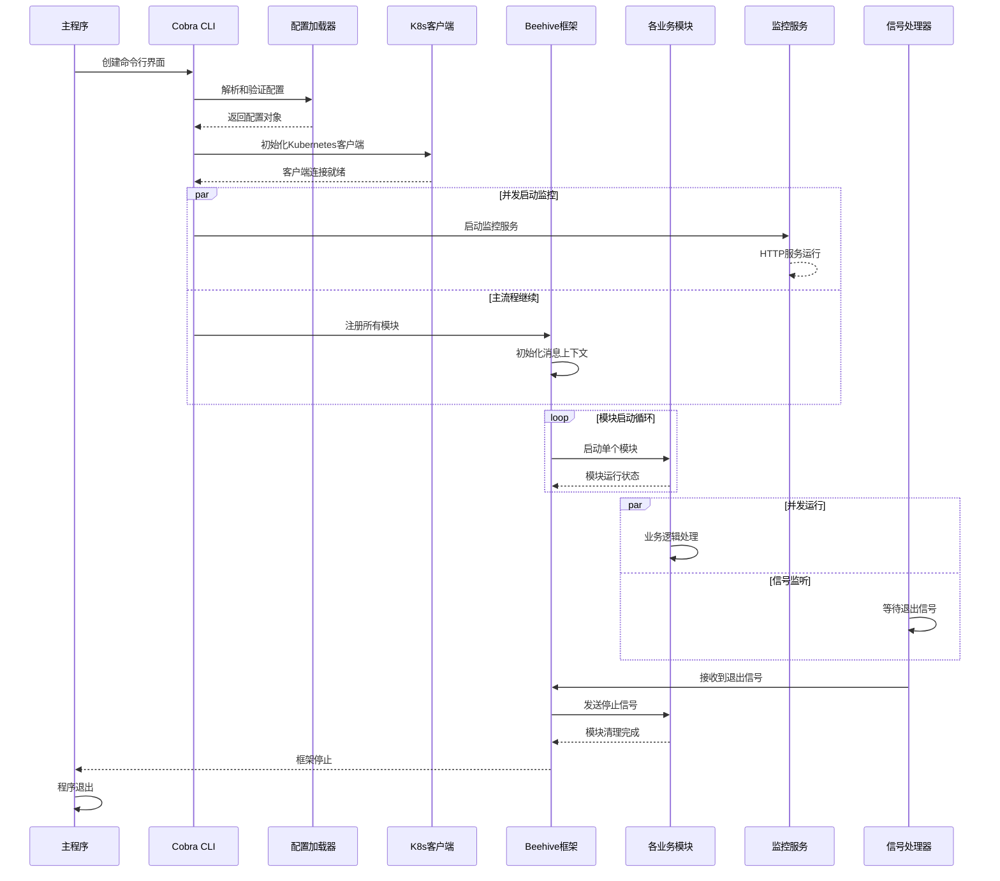

# KubeEdge 核心调用链

## CloudCore 函数调用树

### 主启动流程

```
main() → cloud/cmd/cloudcore/cloudcore.go:27
├── app.NewCloudCoreCommand() → cloud/cmd/cloudcore/app/server.go:64
│   ├── options.NewCloudCoreOptions() → cloud/cmd/cloudcore/app/options/options.go:35
│   │   └── 创建默认配置选项，设置配置文件路径
│   └── cobra.Command.Run() → cloud/cmd/cloudcore/app/server.go:73
│       ├── **[错误处理]** opts.Validate() → cloud/cmd/cloudcore/app/options/options.go:47
│       │   └── 验证配置文件是否存在，检查配置有效性
│       ├── **[错误处理]** opts.Config() → cloud/cmd/cloudcore/app/options/options.go:58
│       │   └── 加载并解析配置文件，返回CloudCoreConfig
│       ├── **[错误处理]** validation.ValidateCloudCoreConfiguration() → api包
│       │   └── 验证配置结构完整性和字段有效性
│       ├── features.DefaultMutableFeatureGate.SetFromMap() → pkg/features
│       │   └── 设置功能特性开关和实验性功能
│       ├── **[并发]** monitor.ServeMonitor() → cloud/pkg/common/monitor
│       │   └── 启动健康检查和指标监控HTTP服务器
│       ├── client.InitKubeEdgeClient() → cloud/pkg/common/client
│       │   └── 初始化Kubernetes客户端连接
│       ├── **[错误处理]** NegotiateTunnelPort() → cloud/cmd/cloudcore/app/server.go:181
│       │   ├── client.CreateNamespaceIfNeeded() → cloud/pkg/common/client
│       │   │   └── 创建kubeedge系统命名空间
│       │   ├── kubeClient.CoreV1().ConfigMaps().Get() → k8s client-go
│       │   │   └── 获取隧道端口配置ConfigMap
│       │   └── 协商云端多实例间的隧道端口分配
│       ├── **[关键分支]** registerModules() → cloud/cmd/cloudcore/app/server.go:165
│       │   ├── cloudhub.Register() → cloud/pkg/cloudhub/cloudhub.go
│       │   │   ├── newCloudHub() → cloud/pkg/cloudhub/cloudhub.go:41
│       │   │   │   ├── session.NewSessionManager() → cloud/pkg/cloudhub/session
│       │   │   │   │   └── 创建WebSocket会话管理器
│       │   │   │   ├── dispatcher.NewMessageDispatcher() → cloud/pkg/cloudhub/dispatcher
│       │   │   │   │   └── 创建消息分发器
│       │   │   │   └── handler.NewMessageHandler() → cloud/pkg/cloudhub/handler
│       │   │   │       └── 创建消息处理器
│       │   │   └── core.Register() → beehive/pkg/core/module.go:40
│       │   │       └── 注册模块到Beehive框架
│       │   ├── edgecontroller.Register() → cloud/pkg/edgecontroller/edgecontroller.go
│       │   │   └── 注册边缘节点控制器，管理Pod和Node元数据
│       │   ├── devicecontroller.Register() → cloud/pkg/devicecontroller/devicecontroller.go
│       │   │   └── 注册设备控制器，处理设备CRD资源
│       │   ├── synccontroller.Register() → cloud/pkg/synccontroller/synccontroller.go
│       │   │   └── 注册同步控制器，处理云边数据同步
│       │   ├── cloudstream.Register() → cloud/pkg/cloudstream/cloudstream.go
│       │   │   └── 注册流式传输服务，提供数据流代理
│       │   ├── router.Register() → cloud/pkg/router/router.go
│       │   │   └── 注册消息路由器，处理消息转发规则
│       │   ├── dynamiccontroller.Register() → cloud/pkg/dynamiccontroller/dynamiccontroller.go
│       │   │   └── 注册动态控制器，处理动态CRD资源
│       │   └── taskmanager.Register() → cloud/pkg/taskmanager/taskmanager.go
│       │       └── 注册任务管理器，处理节点任务分发
│       ├── **[并发]** informers.Start() → cloud/pkg/common/informers
│       │   └── 启动Kubernetes资源监听器
│       └── **[阻塞]** core.Run() → beehive/pkg/core/core.go:74
│           ├── StartModules() → beehive/pkg/core/core.go:16
│           │   ├── beehiveContext.InitContext() → beehive/pkg/core/context
│           │   │   └── 初始化Beehive消息传递上下文
│           │   ├── **[并发]** moduleKeeper() → beehive/pkg/core/core.go:81
│           │   │   └── 为每个模块启动保活协程
│           │   └── **[并发]** module.Start() → 各模块实现
│           │       └── 并发启动所有注册的模块
│           └── **[阻塞]** GracefulShutdown() → beehive/pkg/core/core.go:57
│               ├── signal.Notify() → 系统信号监听
│               └── **[清理]** beehiveContext.Cleanup() → beehive/pkg/core/context
│                   └── 优雅关闭所有模块
└── **[错误处理]** os.Exit(1) → 程序异常退出
    └── 记录错误日志并退出进程
```

## EdgeCore 函数调用树

### 主启动流程

```
main() → edge/cmd/edgecore/edgecore.go:11
├── app.NewEdgeCoreCommand() → edge/cmd/edgecore/app/server.go:42
│   ├── options.NewEdgeCoreOptions() → edge/cmd/edgecore/app/options/options.go
│   │   └── 创建边缘端配置选项，设置默认配置文件路径
│   └── cobra.Command.Run() → edge/cmd/edgecore/app/server.go:57
│       ├── **[错误处理]** opts.Validate() → edge/cmd/edgecore/app/options
│       │   └── 验证边缘端配置文件有效性
│       ├── **[错误处理]** opts.Config() → edge/cmd/edgecore/app/options
│       │   └── 加载边缘端配置文件
│       ├── **[并发]** cleanupToken() → edge/cmd/edgecore/app/server.go:72
│       │   └── 后台清理临时认证token
│       ├── **[错误处理]** validation.ValidateEdgeCoreConfiguration()
│       │   └── 验证边缘端配置完整性
│       ├── features.DefaultFeatureGate.SetFromMap()
│       │   └── 设置边缘端功能特性开关
│       ├── dbm.InitDBConfig() → edge/pkg/common/dbm
│       │   └── 初始化本地SQLite数据库连接
│       ├── **[网络检测]** netutil.ChooseHostInterface() → k8s.io/apimachinery
│       │   └── 自动检测边缘节点网络接口和IP地址
│       ├── **[关键分支]** registerModules() → edge/cmd/edgecore/app/server.go:204
│       │   ├── devicetwin.Register() → edge/pkg/devicetwin/devicetwin.go:34
│       │   │   ├── newDeviceTwin() → edge/pkg/devicetwin/devicetwin.go
│       │   │   │   ├── controller.NewDeviceController() → edge/pkg/devicetwin/controller
│       │   │   │   │   └── 创建设备状态控制器
│       │   │   │   └── dtmanager.NewDeviceTwinManager() → edge/pkg/devicetwin/dtmanager
│       │   │   │       └── 创建设备孪生管理器
│       │   │   └── core.Register() → beehive/pkg/core/module.go:40
│       │   ├── edged.Register() → edge/pkg/edged/edged.go:104
│       │   │   ├── newEdged() → edge/pkg/edged/edged.go
│       │   │   │   ├── nodestatusmanager.NewNodeStatusManager() → edge/pkg/edged/nodestatusmanager
│       │   │   │   │   └── 创建节点状态管理器
│       │   │   │   ├── podmanager.NewPodManager() → edge/pkg/edged/podmanager
│       │   │   │   │   └── 创建Pod生命周期管理器
│       │   │   │   └──容器运行时接口初始化
│       │   │   └── core.Register()
│       │   ├── edgehub.Register() → edge/pkg/edgehub/edgehub.go:56
│       │   │   ├── newEdgeHub() → edge/pkg/edgehub/edgehub.go:44
│       │   │   │   ├── certificate.NewCertManager() → edge/pkg/edgehub/certificate
│       │   │   │   │   └── 创建证书管理器
│       │   │   │   ├── clients.GetClient() → edge/pkg/edgehub/clients
│       │   │   │   │   └── 创建WebSocket客户端适配器
│       │   │   │   └── msghandler.RegisterHandlers() → edge/pkg/edgehub/messagehandler
│       │   │   │       └── 注册消息处理函数
│       │   │   └── core.Register()
│       │   ├── eventbus.Register() → edge/pkg/eventbus/eventbus.go:38
│       │   │   ├── newEventBus() → edge/pkg/eventbus/eventbus.go
│       │   │   │   ├── mqtt.NewClient() → edge/pkg/eventbus/mqtt
│       │   │   │   │   └── 创建MQTT客户端连接
│       │   │   │   └── mqtt.RegisterMsgHandler() → edge/pkg/eventbus/mqtt/filter.go:154
│       │   │   │       └── 注册MQTT消息过滤器和处理器
│       │   │   └── core.Register()
│       │   ├── metamanager.Register() → edge/pkg/metamanager/metamanager.go:32
│       │   │   ├── newMetaManager() → edge/pkg/metamanager/metamanager.go
│       │   │   │   ├── dao.InitDBTable() → edge/pkg/metamanager/dao
│       │   │   │   │   └── 初始化元数据数据库表结构
│       │   │   │   └── processor.NewProcessor() → edge/pkg/metamanager/processor
│       │   │   │       └── 创建消息处理器
│       │   │   └── core.Register()
│       │   ├── servicebus.Register() → edge/pkg/servicebus/servicebus.go:73
│       │   │   ├── newServiceBus() → edge/pkg/servicebus/servicebus.go
│       │   │   │   └── 创建HTTP服务总线客户端
│       │   │   └── core.Register()
│       │   ├── edgestream.Register() → edge/pkg/edgestream/edgestream.go
│       │   │   └── 注册边缘端流式传输服务
│       │   └── taskmanager.Register() → edge/pkg/taskmanager/taskmanager.go
│       │       └── 注册边缘端任务管理器
│       ├── **[功能特性]** core.EnableModuleRestart() → beehive/pkg/core/core.go:85
│       │   └── 启用模块自动重启功能
│       └── **[阻塞]** core.Run() → beehive/pkg/core/core.go:74
│           └── 与CloudCore相同的Beehive框架启动流程
└── **[错误处理]** os.Exit(1)
```

## keadm 命令调用树

### 主命令流程

```
main() → keadm/cmd/keadm/keadm.go:25
├── app.Run() → keadm/cmd/keadm/app/keadm.go:32
│   ├── cmd.NewKubeedgeCommand() → keadm/cmd/keadm/app/cmd/cmd_others.go:66
│   │   ├── **[子命令分支]** cloud.NewCloudInit() → keadm/cmd/keadm/app/cmd/cloud/init.go:48
│   │   │   └── cobra.Command.RunE() → keadm/cmd/keadm/app/cmd/cloud/init.go:55
│   │   │       ├── **[前置检查]** util.CheckKubernetesVersion() → keadm/cmd/keadm/app/cmd/util
│   │   │       │   └── 检查Kubernetes集群版本兼容性
│   │   │       ├── **[错误处理]** util.ValidateKubeConfig() → keadm/cmd/keadm/app/cmd/util
│   │   │       │   └── 验证kubeconfig文件有效性
│   │   │       ├── helm.InstallKubeEdgeCloud() → keadm/cmd/keadm/app/cmd/helm
│   │   │       │   ├── helm.NewClient() → keadm/cmd/keadm/app/cmd/helm
│   │   │       │   │   └── 创建Helm客户端
│   │   │       │   ├── helm.LoadChart() → keadm/cmd/keadm/app/cmd/helm
│   │   │       │   │   └── 加载KubeEdge CloudCore Helm Chart
│   │   │       │   ├── **[模板渲染]** helm.RenderManifests() → keadm/cmd/keadm/app/cmd/helm
│   │   │       │   │   └── 渲染Kubernetes部署清单
│   │   │       │   └── **[部署执行]** helm.Install() → keadm/cmd/keadm/app/cmd/helm
│   │   │       │       └── 安装CloudCore到Kubernetes集群
│   │   │       └── **[后置配置]** util.GenerateToken() → keadm/cmd/keadm/app/cmd/util
│   │   │           └── 生成边缘节点加入集群的认证token
│   │   ├── **[子命令分支]** edge.NewJoinEdge() → keadm/cmd/keadm/app/cmd/edge/join.go
│   │   │   └── cobra.Command.RunE() → keadm/cmd/keadm/app/cmd/edge/join.go:67
│   │   │       ├── **[网络检查]** util.CheckCloudCoreIPPort() → keadm/cmd/keadm/app/cmd/util
│   │   │       │   ├── net.DialTimeout() → 网络连接测试
│   │   │       │   └── 验证CloudCore服务可达性
│   │   │       ├── **[证书获取]** util.GetCACert() → keadm/cmd/keadm/app/cmd/util
│   │   │       │   ├── http.Get() → HTTPS请求
│   │   │       │   └── 下载CloudCore的CA证书
│   │   │       ├── **[组件安装]** util.InstallEdgeCore() → keadm/cmd/keadm/app/cmd/util
│   │   │       │   ├── util.DownloadServiceFile() → keadm/cmd/keadm/app/cmd/util
│   │   │       │   │   └── 下载EdgeCore二进制文件
│   │   │       │   ├── util.CreateEdgeCoreConfig() → keadm/cmd/keadm/app/cmd/util
│   │   │       │   │   └── 生成EdgeCore配置文件
│   │   │       │   └── util.CreateSystemdService() → keadm/cmd/keadm/app/cmd/util
│   │   │       │       └── 创建systemd服务文件
│   │   │       └── **[服务启动]** util.StartEdgeCoreService() → keadm/cmd/keadm/app/cmd/util
│   │   │           ├── exec.Command("systemctl", "enable") → 系统调用
│   │   │           └── exec.Command("systemctl", "start") → 系统调用
│   │   ├── **[子命令分支]** ctl.NewCtl() → keadm/cmd/keadm/app/cmd/ctl/ctl.go:35
│   │   │   ├── get.NewEdgeGet() → keadm/cmd/keadm/app/cmd/ctl/get/get.go:26
│   │   │   │   ├── device.NewEdgeDeviceGet() → keadm/cmd/keadm/app/cmd/ctl/get/device.go:50
│   │   │   │   │   └── 查询边缘设备资源信息
│   │   │   │   └── pod.NewEdgePodGet() → keadm/cmd/keadm/app/cmd/ctl/get/pod.go:56
│   │   │   │       └── 查询边缘Pod资源信息
│   │   │   ├── describe.NewEdgeDescribe() → keadm/cmd/keadm/app/cmd/ctl/describe/describe.go:24
│   │   │   ├── logs.NewEdgePodLogs() → keadm/cmd/keadm/app/cmd/ctl/logs/logs.go:61
│   │   │   ├── exec.NewEdgePodExec() → keadm/cmd/keadm/app/cmd/ctl/exec/exec.go:57
│   │   │   └── edit.NewEdgeEdit() → keadm/cmd/keadm/app/cmd/ctl/edit/edit.go:23
│   │   ├── **[调试工具]** debug.NewEdgeDebug() → keadm/cmd/keadm/app/cmd/debug/debug.go:26
│   │   │   ├── collect.NewCollect() → keadm/cmd/keadm/app/cmd/debug/collect.go:32
│   │   │   │   └── 收集边缘节点调试信息
│   │   │   ├── check.NewCheck() → keadm/cmd/keadm/app/cmd/debug/check.go:59
│   │   │   │   └── 检查边缘节点健康状态
│   │   │   └── diagnose.NewDiagnose() → keadm/cmd/keadm/app/cmd/debug/diagnose.go:42
│   │   │       └── 诊断边缘节点问题
│   │   └── version.NewCmdVersion() → keadm/cmd/keadm/app/cmd/version.go:18
│   │       └── 显示keadm和KubeEdge版本信息
│   ├── klog.InitFlags() → k8s.io/klog/v2
│   │   └── 初始化日志标志
│   └── cmd.Execute() → github.com/spf13/cobra
│       └── 执行对应的子命令
└── **[错误处理]** os.Exit(1)
```

## Beehive 框架调用流程

### 核心框架流程

```
core.Run() → beehive/pkg/core/core.go:74
├── StartModules() → beehive/pkg/core/core.go:16
│   ├── beehiveContext.InitContext() → beehive/pkg/core/context/context_factory.go
│   │   ├── **[通信初始化]** channel.NewChannelContext() → beehive/pkg/core/channel
│   │   │   ├── channel.NewMsgChannel() → beehive/pkg/core/channel
│   │   │   │   └── 创建模块间消息通道
│   │   │   └── **[并发]** dispatcher.Start() → beehive/pkg/core/channel
│   │   │       └── 启动消息分发协程
│   │   └── context.AddModule() → beehive/pkg/core/context
│   │       └── 将模块添加到消息传递上下文
│   ├── **[模块遍历]** GetModules() → beehive/pkg/core/module.go:62
│   │   └── 获取所有已注册的模块信息
│   └── **[并发启动]** moduleKeeper() / localModuleKeeper() → beehive/pkg/core/core.go:81,96
│       ├── **[远程模块]** moduleKeeper() → beehive/pkg/core/core.go:81
│       │   ├── module.Start() → 各模块实现
│       │   │   └── 启动模块主循环
│       │   ├── beehiveContext.AddModule() → beehive/pkg/core/context
│       │   │   └── 动态添加远程模块
│       │   └── **[循环重启]** 模块异常退出后自动重启
│       └── **[本地模块]** localModuleKeeper() → beehive/pkg/core/core.go:96
│           ├── **[功能特性]** moduleRestartEnabled检查
│           ├── module.Start() → 各模块实现
│           └── **[自动重启]** 模块崩溃后自动重启（如果启用）
└── **[信号监听]** GracefulShutdown() → beehive/pkg/core/core.go:57
    ├── signal.Notify() → 监听系统信号
    │   └── 捕获SIGINT, SIGHUP, SIGTERM等信号
    ├── beehiveContext.Cancel() → beehive/pkg/core/context
    │   └── 取消所有模块的上下文
    └── **[清理循环]** beehiveContext.Cleanup() → beehive/pkg/core/context
        └── 逐个清理所有模块资源
```

## 关键分支点标注

### 错误处理分支

| 位置 | 函数 | 处理策略 | 影响范围 |
|------|------|----------|----------|
| **配置验证** | `opts.Validate()` | klog.Exit() 立即退出 | 程序启动失败 |
| **配置加载** | `opts.Config()` | klog.Exit() 立即退出 | 配置文件解析错误 |
| **Kubernetes连接** | `client.InitKubeEdgeClient()` | Panic 程序崩溃 | 无法连接API Server |
| **隧道协商** | `NegotiateTunnelPort()` | Panic 程序崩溃 | 多实例端口冲突 |
| **模块启动** | `module.Start()` | 日志记录 + 重启 | 单个模块失败 |
| **网络连接** | `CheckCloudCoreIPPort()` | 返回错误 + 重试 | keadm join失败 |

### 并发分支

| 位置 | 函数 | 并发模式 | 同步机制 |
|------|------|----------|----------|
| **监控服务** | `monitor.ServeMonitor()` | goroutine | HTTP服务器 |
| **模块启动** | `moduleKeeper()` | 每模块一个goroutine | channel通信 |
| **消息分发** | `dispatcher.Start()` | 独立协程 | 消息队列 |
| **信号处理** | `GracefulShutdown()` | 阻塞等待 | signal.Notify |
| **证书清理** | `cleanupToken()` | 后台协程 | channel通知 |
| **Informers** | `informers.Start()` | controller模式 | 事件驱动 |

### 中间件机制

| 组件 | 中间件类型 | 位置 | 功能 |
|------|------------|------|------|
| **认证中间件** | Authorization | `cloudhub/authorization` | 验证边缘节点身份 |
| **消息中间件** | MessageDispatcher | `cloudhub/dispatcher` | 消息路由和分发 |
| **会话中间件** | SessionManager | `cloudhub/session` | WebSocket会话管理 |
| **证书中间件** | CertManager | `edgehub/certificate` | 自动证书申请和更新 |
| **限流中间件** | RateLimiter | `edgehub/edgehub.go:49` | 消息发送速率限制 |
| **重试中间件** | RetryClient | `edgehub/clients` | 网络连接自动重试 |

## Mermaid 时序图 - 主干调用链



## 关键调用路径总结

### CloudCore 启动路径
1. **初始化阶段**: main → NewCloudCoreCommand → opts.Config → 配置验证
2. **客户端阶段**: InitKubeEdgeClient → NegotiateTunnelPort → 网络配置
3. **模块注册**: registerModules → 各模块Register → core.Register
4. **框架启动**: core.Run → StartModules → 并发启动所有模块
5. **运行阶段**: 各模块Start → 业务逻辑循环 → GracefulShutdown

### EdgeCore 启动路径
1. **初始化阶段**: main → NewEdgeCoreCommand → opts.Config → 配置验证
2. **本地准备**: InitDBConfig → 网络检测 → 证书处理
3. **模块注册**: registerModules → 各模块Register → core.Register
4. **框架启动**: core.Run → StartModules → 并发启动所有模块
5. **运行阶段**: 各模块Start → 云边通信 → 容器管理

### keadm 执行路径
1. **命令解析**: main → app.Run → NewKubeedgeCommand → 子命令路由
2. **环境检查**: 网络连通性 → Kubernetes版本 → 配置有效性
3. **组件安装**: 下载二进制 → 生成配置 → 创建服务 → 启动服务
4. **后续操作**: 状态检查 → 日志收集 → 问题诊断

### 错误恢复机制
- **配置错误**: 立即退出，提示用户修正
- **网络错误**: 自动重试，指数退避算法
- **模块崩溃**: 自动重启，保持服务可用性
- **资源不足**: 降级运行，记录告警信息