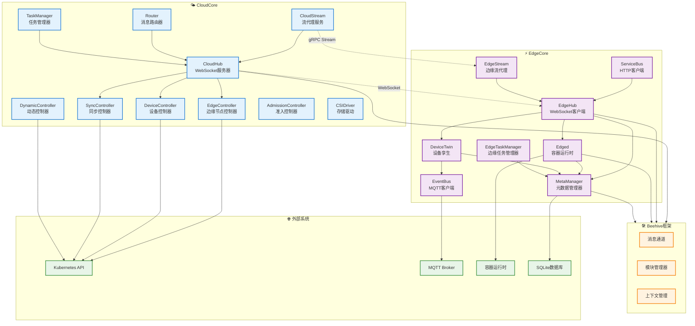

# KubeEdge 模块依赖与数据流

## 模块依赖关系图



## 重要数据结构

### 云端核心数据结构

#### CloudHub 结构
```go
// cloud/pkg/cloudhub/cloudhub.go:31
type cloudHub struct {
    enable               bool                    // 模块启用标志
    informersSyncedFuncs []cache.InformerSynced  // Kubernetes资源同步函数
    messageHandler       handler.Handler         // 消息处理器
    dispatcher           dispatcher.MessageDispatcher // 消息分发器
}
```
**职责**: 作为云端WebSocket服务器，处理来自边缘节点的连接和消息路由

#### NodeSession 结构
```go
// cloud/pkg/cloudhub/session/node_session.go:59
type NodeSession struct {
    NodeID       string                 // 边缘节点唯一标识
    Conn         connection.Connection  // WebSocket连接对象
    MessageQueue chan model.Message     // 消息发送队列
    WriteMutex   sync.Mutex            // 写入互斥锁
    Heartbeat    time.Time             // 心跳时间戳
    State        int32                 // 会话状态
}
```
**职责**: 管理单个边缘节点的WebSocket会话，包括连接状态、消息队列和心跳检测

#### HubInfo 结构
```go
// cloud/pkg/cloudhub/common/model/types.go:63
type HubInfo struct {
    NodeID      string            // 节点标识
    ProjectID   string            // 项目标识
    Connections map[string]*Connection // 连接映射
}
```
**职责**: 维护节点的项目信息和连接状态

### 边缘端核心数据结构

#### EdgeHub 结构
```go
// edge/pkg/edgehub/edgehub.go:21
type EdgeHub struct {
    certManager   certificate.CertManager  // 证书管理器
    chClient      clients.Adapter          // 客户端适配器
    reconnectChan chan struct{}            // 重连信号通道
    rateLimiter   flowcontrol.RateLimiter  // 限流器
    keeperLock    sync.RWMutex            // 读写锁
    enable        bool                     // 启用标志
}
```
**职责**: 边缘端WebSocket客户端，负责与云端建立和维护连接

#### WebSocketClient 结构
```go
// edge/pkg/edgehub/clients/wsclient/websocket.go:27
type WebSocketClient struct {
    config     *WebSocketConfig     // WebSocket配置
    connection *websocket.Conn      // WebSocket连接
    readLock   sync.Mutex          // 读锁
    writeLock  sync.Mutex          // 写锁
    stopCh     chan struct{}       // 停止信号
}
```
**职责**: 具体的WebSocket连接实现，处理消息的发送和接收

#### CertManager 结构
```go
// edge/pkg/edgehub/certificate/certmanager.go:43
type CertManager struct {
    caURL           string              // CA证书URL
    certURL         string              // 客户端证书URL
    EdgeCert        tls.Certificate     // 边缘证书
    CaCert          *x509.Certificate   // CA证书
    syncChan        chan bool           // 同步通道
    stopCh          chan struct{}       // 停止通道
}
```
**职责**: 管理边缘节点的证书申请、更新和验证

### 消息传递数据结构

#### Message 结构 (Beehive框架)
```go
// staging/src/github.com/kubeedge/beehive/pkg/core/model/message.go
type Message struct {
    Header   MessageHeader `json:"header"`   // 消息头
    Router   MessageRoute  `json:"route"`    // 路由信息
    Content  interface{}   `json:"content"`  // 消息内容
}

type MessageHeader struct {
    ID        string    `json:"msg_id"`       // 消息ID
    ParentID  string    `json:"parent_msg_id"` // 父消息ID
    Timestamp int64     `json:"timestamp"`    // 时间戳
    Sync      bool      `json:"sync"`         // 是否同步消息
}

type MessageRoute struct {
    Source     string `json:"source"`      // 源模块
    Group      string `json:"group"`       // 目标模块组
    Operation  string `json:"operation"`   // 操作类型
    Resource   string `json:"resource"`    // 资源路径
}
```
**职责**: Beehive框架统一的消息格式，用于模块间通信

### 设备管理数据结构

#### Device 结构
```go
// staging/src/github.com/kubeedge/api/apis/devices/v1alpha2/types.go
type Device struct {
    metav1.TypeMeta   `json:",inline"`
    metav1.ObjectMeta `json:"metadata,omitempty"`
    Spec   DeviceSpec   `json:"spec,omitempty"`
    Status DeviceStatus `json:"status,omitempty"`
}

type DeviceSpec struct {
    DeviceModelRef *v1.LocalObjectReference `json:"deviceModelRef,omitempty"`
    Protocol       ProtocolConfig           `json:"protocol,omitempty"`
    NodeSelector   *v1.NodeSelector         `json:"nodeSelector,omitempty"`
    Properties     []DeviceProperty         `json:"properties,omitempty"`
}
```
**职责**: 设备CRD定义，描述边缘设备的规格和状态

## 典型请求处理流程

### 1. 边缘节点注册流程

#### 输入
- **协议**: HTTPS POST
- **端点**: `/edge.crt`
- **入参**: 节点证书签名请求(CSR)

#### 处理层次
```
EdgeCore发起请求
→ CloudHub HTTP服务器
→ CertificateHandler.EdgeCoreClientCert()
→ 证书签名服务
→ Kubernetes CSR API
→ 返回签名证书
```

#### 详细流程
1. **EdgeCore启动**: edge/cmd/edgecore/app/server.go:140
   - 加载配置文件
   - 初始化证书管理器

2. **证书申请**: edge/pkg/edgehub/certificate/certmanager.go:70
   ```go
   func (cm *CertManager) GetEdgeCert() {
       // 生成私钥和CSR
       // 发送HTTPS请求到CloudCore
       // 接收并验证证书
   }
   ```

3. **CloudCore处理**: cloud/pkg/cloudhub/servers/httpserver/certificate/
   ```go
   func EdgeCoreClientCert(request *restful.Request, response *restful.Response) {
       // 验证CSR有效性
       // 调用Kubernetes CSR API
       // 返回签名证书
   }
   ```

#### 存储
- **边缘端**: 证书保存到本地文件系统
- **云端**: CSR记录保存到Kubernetes etcd

### 2. Pod生命周期管理流程

#### 输入
- **协议**: Kubernetes API调用
- **资源**: Pod对象
- **操作**: CREATE/UPDATE/DELETE

#### 处理层次
```
kubectl apply
→ Kubernetes API Server
→ EdgeController.syncPod()
→ CloudHub消息分发
→ EdgeHub消息接收
→ MetaManager存储
→ Edged执行操作
→ 容器运行时
```

#### 详细流程
1. **云端监听**: cloud/pkg/edgecontroller/edgecontroller.go
   ```go
   func (ec *EdgeController) syncPod(key string) {
       // 获取Pod对象
       // 判断目标边缘节点
       // 构造消息发送到EdgeHub
   }
   ```

2. **消息路由**: cloud/pkg/cloudhub/dispatcher/dispatcher.go
   ```go
   func (md *MessageDispatcher) dispatch(message *model.Message) {
       // 根据NodeID查找会话
       // 通过WebSocket发送消息
   }
   ```

3. **边缘接收**: edge/pkg/edgehub/edgehub.go
   ```go
   func (eh *EdgeHub) messageHandler() {
       // 接收WebSocket消息
       // 解析消息类型
       // 转发到对应模块
   }
   ```

4. **本地存储**: edge/pkg/metamanager/metamanager.go
   ```go
   func (m *metaManager) process(message model.Message) {
       // 解析资源对象
       // 存储到SQLite数据库
       // 通知相关模块
   }
   ```

5. **容器执行**: edge/pkg/edged/edged.go
   ```go
   func (e *edged) handlePodAdditions(pods []*v1.Pod) {
       // 调用容器运行时
       // 创建Pod容器
       // 更新Pod状态
   }
   ```

#### 存储
- **云端**: Kubernetes etcd存储Pod定义
- **边缘端**: SQLite存储Pod元数据，容器运行时管理实际容器

### 3. 设备数据上报流程

#### 输入
- **协议**: MQTT
- **主题**: `$hw/events/device/{device-id}/twin/update`
- **载荷**: 设备属性JSON数据

#### 处理层次
```
设备/传感器
→ MQTT Broker
→ EventBus.mqttHandler()
→ DeviceTwin.updateTwin()
→ MetaManager存储
→ EdgeHub上报
→ CloudHub接收
→ DeviceController处理
→ Kubernetes API更新
```

#### 详细流程
1. **MQTT接收**: edge/pkg/eventbus/mqtt/client.go
   ```go
   func (c *Client) onMessage(topic string, payload []byte) {
       // 解析MQTT消息
       // 构造Beehive消息
       // 发送到DeviceTwin模块
   }
   ```

2. **设备孪生处理**: edge/pkg/devicetwin/dtmanager/manager.go
   ```go
   func (dm *DeviceTwinManager) updateDeviceState(msg *model.Message) {
       // 更新设备属性
       // 存储到本地数据库
       // 构造上报消息
   }
   ```

3. **云端同步**: cloud/pkg/devicecontroller/manager/manager.go
   ```go
   func (m *DeviceManager) updateDeviceStatus(device *v1alpha2.Device) {
       // 更新Device CRD状态
       // 调用Kubernetes API
   }
   ```

#### 存储
- **边缘端**: SQLite存储设备状态
- **云端**: Kubernetes etcd存储Device CRD

### 4. 日志和监控数据收集流程

#### 输入
- **协议**: gRPC Stream
- **端点**: CloudStream服务
- **数据**: 容器日志、节点指标

#### 处理层次
```
kubelet/容器运行时
→ EdgeStream.collectLogs()
→ gRPC Stream连接
→ CloudStream.handleStream()
→ 云端日志聚合
→ 存储/转发到监控系统
```

#### 详细流程
1. **边缘收集**: edge/pkg/edgestream/edgestream.go
   ```go
   func (es *EdgeStream) collectMetrics() {
       // 从kubelet获取指标
       // 建立gRPC Stream连接
       // 流式传输数据
   }
   ```

2. **云端处理**: cloud/pkg/cloudstream/cloudstream.go
   ```go
   func (cs *CloudStream) handleLogStream(stream pb.CloudStream_LogsServer) {
       // 接收流式日志数据
       // 解析日志格式
       // 转发到日志系统
   }
   ```

## API 接口文档

### CloudCore HTTP API

| 路径 | 方法 | 入参 | 出参 | 中间件 | 功能说明 |
|------|------|------|------|--------|----------|
| `/ca.crt` | GET | 无 | PEM格式CA证书 | TLS认证 | 获取CloudCore的CA证书 |
| `/edge.crt` | GET | `nodename`查询参数 | PEM格式客户端证书 | TLS认证 + 节点验证 | 为边缘节点签发客户端证书 |
| `/node/{nodename}` | GET | 路径参数:`nodename` | 节点状态JSON | TLS认证 | 检查节点是否存在于集群中 |
| `/nodeupgrade` | POST | 升级任务JSON | 任务响应JSON | TLS认证 + 授权 | 下发节点升级任务 |
| `/task/{taskType}/name/{taskID}/node/{nodeID}/status` | POST | 路径参数+状态JSON | 响应JSON | TLS认证 | 上报任务执行状态 |

### CloudCore WebSocket API

| 端点 | 协议 | 消息格式 | 认证方式 | 功能说明 |
|------|------|----------|----------|----------|
| `/` | WebSocket | Beehive Message JSON | 客户端证书 | 云边消息通道 |
| `/events` | WebSocket | Event Stream | 客户端证书 | 事件流传输 |

### CloudStream gRPC API

| 服务 | 方法 | 入参 | 出参 | 功能说明 |
|------|------|------|------|----------|
| `CloudStream` | `Logs` | `LogsRequest` Stream | `LogsResponse` Stream | 容器日志流式传输 |
| `CloudStream` | `Exec` | `ExecRequest` Stream | `ExecResponse` Stream | 容器命令执行 |
| `CloudStream` | `Metrics` | `MetricsRequest` | `MetricsResponse` Stream | 节点指标收集 |

### EdgeCore 内部API

#### MetaServer API (模拟Kubernetes API)

| 路径 | 方法 | 功能说明 |
|------|------|----------|
| `/api/v1/pods` | GET/POST/PUT/DELETE | Pod资源CRUD操作 |
| `/api/v1/nodes/{nodename}` | GET/PATCH | 节点资源操作 |
| `/api/v1/configmaps` | GET/POST/PUT/DELETE | ConfigMap资源操作 |
| `/api/v1/secrets` | GET/POST/PUT/DELETE | Secret资源操作 |
| `/apis/apps/v1/deployments` | GET/POST/PUT/DELETE | Deployment资源操作 |

#### EventBus MQTT API

| 主题模式 | 消息方向 | 功能说明 |
|----------|----------|----------|
| `$hw/events/device/{device-id}/twin/update` | 设备→边缘 | 设备属性更新 |
| `$hw/events/device/{device-id}/twin/get` | 边缘→设备 | 获取设备属性 |
| `$hw/events/node/{node-id}/membership/get` | 云→边缘 | 节点成员资格查询 |
| `$hw/events/node/{node-id}/membership/updated` | 边缘→云 | 节点状态更新 |

## 数据流向和存储

### 云端数据流
```
Kubernetes API Server (etcd)
↓
EdgeController/DeviceController (内存缓存)
↓
CloudHub消息队列
↓
WebSocket连接
↓
边缘节点
```

### 边缘端数据流
```
EdgeHub WebSocket
↓
MetaManager (SQLite)
↓
Edged/DeviceTwin (内存)
↓
容器运行时/MQTT设备
```

### 状态同步机制
- **可靠性保证**: 通过ObjectSync和ClusterObjectSync CRD实现
- **断网恢复**: 边缘节点重连后自动同步状态差异
- **冲突解决**: 云端状态优先，边缘端状态定期上报

### 性能优化
- **消息批处理**: CloudHub支持消息合并发送
- **本地缓存**: MetaManager提供本地API缓存
- **连接池**: WebSocket连接复用和心跳保活
- **压缩传输**: gRPC和WebSocket支持数据压缩

## 安全机制

### 认证授权
- **证书认证**: mTLS双向认证
- **RBAC授权**: 基于Kubernetes RBAC的细粒度权限控制
- **节点隔离**: 节点只能访问分配给它的资源

### 网络安全
- **加密传输**: 所有通信使用TLS/SSL加密
- **证书轮换**: 自动证书更新和轮换
- **网络隔离**: 云边通信通过指定端口和协议

### 数据安全
- **敏感数据加密**: Secret资源端到端加密
- **审计日志**: 完整的操作审计追踪
- **访问控制**: 基于命名空间的多租户隔离