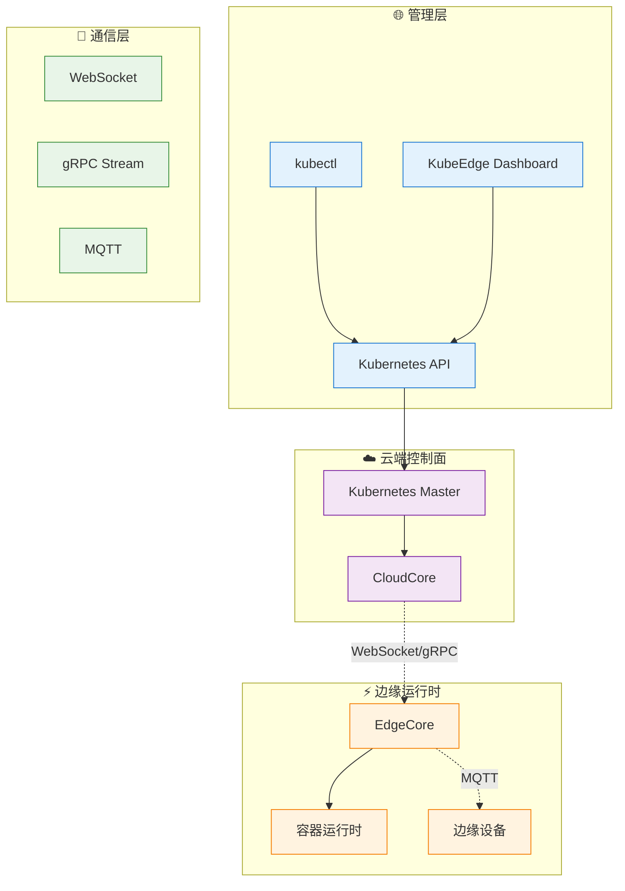
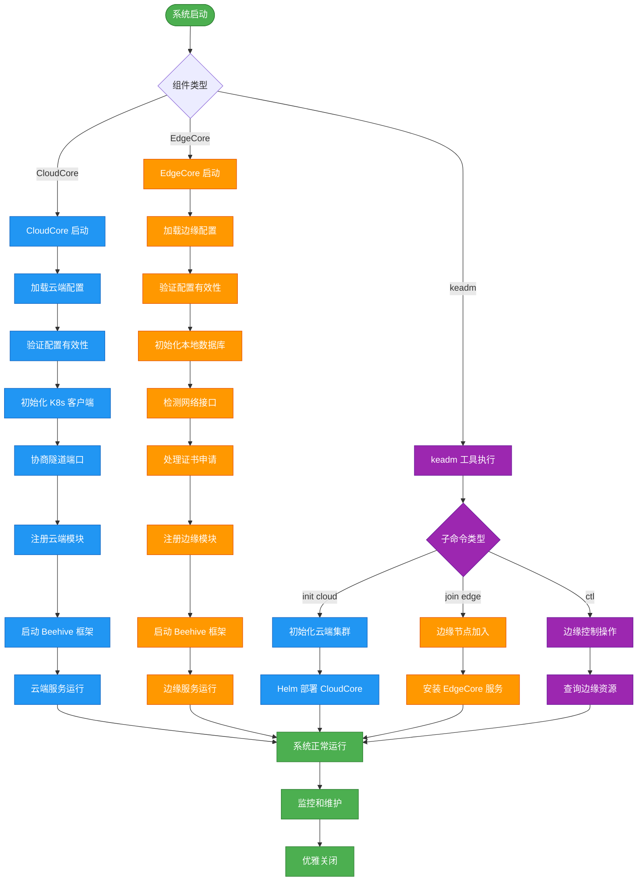
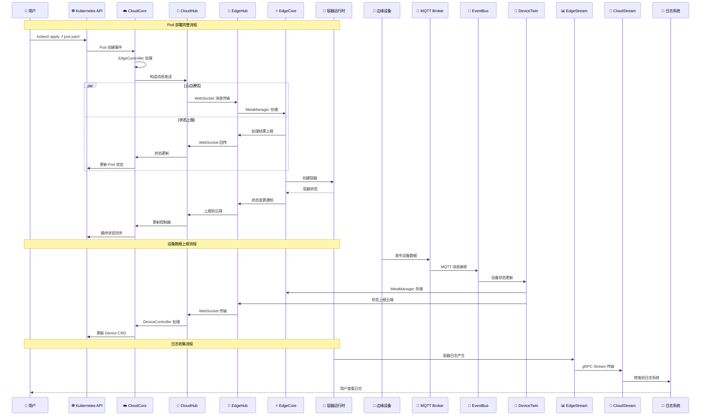
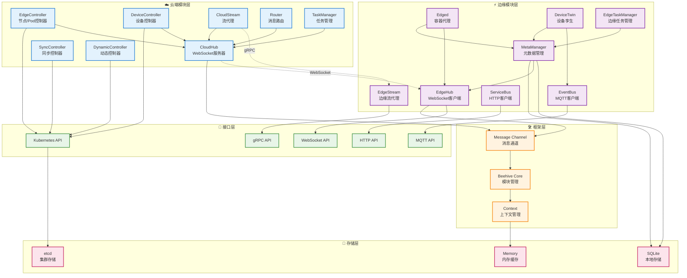

# KubeEdge 系统架构文档

## 系统整体架构综述

### 架构概述

KubeEdge 是一个基于 Kubernetes 的云原生边缘计算框架，采用云边协同的分布式架构设计。系统由**云端控制面**和**边缘运行时**两大部分组成，通过可靠的云边通信机制实现统一的容器化应用编排和设备管理。

### 核心设计理念

1. **云原生扩展**: 完全兼容 Kubernetes API，无缝扩展云原生能力到边缘
2. **云边协同**: 云端负责管控，边缘负责执行，实现职责分离
3. **离线自治**: 边缘节点支持断网运行，保证业务连续性
4. **轻量化设计**: 边缘组件资源占用小，适应资源受限环境
5. **设备集成**: 原生支持边缘设备接入和管理

### 架构分层



### 关键特性

- **Kubernetes 原生兼容**: 支持标准 Kubernetes API 和资源对象
- **可靠云边通信**: WebSocket + 消息重传 + 断网缓存
- **边缘自治能力**: 本地 API Server + SQLite 存储
- **设备管理**: CRD + MQTT 协议栈
- **流式数据传输**: gRPC Stream 支持日志、执行、监控
- **安全保障**: mTLS 双向认证 + RBAC 授权

## 顶层目录结构

| 目录 | 作用 | 关键文件 |
|------|------|----------|
| **cloud/** | 云端组件实现 | cmd/cloudcore/, pkg/cloudhub/, pkg/edgecontroller/ |
| **edge/** | 边缘端组件实现 | cmd/edgecore/, pkg/edgehub/, pkg/edged/ |
| **keadm/** | 集群管理工具 | cmd/keadm/, app/cmd/cloud/, app/cmd/edge/ |
| **pkg/** | 共享工具库 | util/, version/, stream/, features/ |
| **staging/** | API 和框架定义 | src/github.com/kubeedge/api/, src/github.com/kubeedge/beehive/ |
| **common/** | 通用常量和工具 | constants/, types/ |
| **build/** | 构建配置 | cloud/, edge/, tools/ |
| **manifests/** | 部署清单 | charts/, profiles/ |
| **hack/** | 构建脚本 | make-rules/, lib/, generate-*.sh |
| **tests/** | 测试用例 | e2e/, performance/, integration/ |
| **docs/** | 项目文档 | proposals/, setup/, user-guide/ |
| **vendor/** | 第三方依赖 | 所有外部 Go 模块 |
| **edgesite/** | 边缘站点组件 | cmd/edgesite-agent/, cmd/edgesite-server/ |
| **mappers/** | 设备映射器 | modbus/, bluetooth/, opcua/ |

### 核心目录详解

#### cloud/ - 云端组件
```
cloud/
├── cmd/                    # 可执行程序入口
│   ├── cloudcore/         # 云端核心服务
│   ├── admission/         # 准入控制器
│   ├── controllermanager/ # 控制器管理器
│   └── csidriver/         # CSI 存储驱动
└── pkg/                   # 云端模块实现
    ├── cloudhub/          # WebSocket 服务器
    ├── edgecontroller/    # 边缘节点控制器
    ├── devicecontroller/  # 设备控制器
    ├── synccontroller/    # 同步控制器
    └── cloudstream/       # 流代理服务
```

#### edge/ - 边缘组件
```
edge/
├── cmd/                   # 可执行程序入口
│   ├── edgecore/         # 边缘核心服务
│   └── edgemark/         # 性能测试工具
└── pkg/                  # 边缘模块实现
    ├── edgehub/          # WebSocket 客户端
    ├── edged/            # 容器运行时代理
    ├── metamanager/      # 元数据管理器
    ├── devicetwin/       # 设备孪生
    ├── eventbus/         # MQTT 事件总线
    └── servicebus/       # HTTP 服务总线
```

#### staging/ - API 和框架
```
staging/src/github.com/kubeedge/
├── api/                  # KubeEdge API 定义
│   └── apis/
│       ├── devices/      # 设备 CRD
│       ├── operations/   # 操作 CRD
│       └── componentconfig/ # 组件配置
└── beehive/             # 微服务框架
    └── pkg/
        ├── core/        # 核心框架
        └── common/      # 通用类型
```

## 启动流程图



## 核心调用链时序图



## 模块依赖关系图



## 外部依赖

### 数据库依赖

| 组件 | 数据库类型 | 用途 | 配置位置 |
|------|------------|------|----------|
| **Kubernetes** | etcd | 集群状态存储 | Kubernetes 配置 |
| **EdgeCore** | SQLite | 边缘本地存储 | edgecore.yaml |
| **MetaManager** | SQLite | 元数据缓存 | edgecore.yaml |
| **DeviceTwin** | SQLite | 设备状态存储 | edgecore.yaml |

### 消息队列

| 组件 | 消息系统 | 协议 | 用途 |
|------|----------|------|------|
| **CloudHub** | WebSocket | WSS | 云边主通信通道 |
| **EventBus** | MQTT Broker | MQTT 3.1.1 | 设备消息总线 |
| **Beehive** | Channel | 内存队列 | 模块间消息传递 |

### 缓存系统

| 组件 | 缓存类型 | 用途 |
|------|----------|------|
| **EdgeController** | 内存缓存 | Kubernetes 对象缓存 |
| **MetaManager** | SQLite + 内存 | API 对象本地缓存 |
| **SessionManager** | 内存 | WebSocket 会话缓存 |

### 第三方服务 API

| 服务类型 | API/协议 | 使用场景 |
|----------|----------|----------|
| **Kubernetes API** | REST/gRPC | 集群资源管理 |
| **Container Runtime** | CRI gRPC | 容器生命周期管理 |
| **CNI** | 网络插件 | 容器网络配置 |
| **CSI** | 存储插件 | 容器存储管理 |

### 网络和安全依赖

| 依赖类型 | 组件 | 用途 |
|----------|------|------|
| **TLS/SSL** | 证书管理 | 加密通信 |
| **Kubernetes RBAC** | 权限控制 | 访问授权 |
| **iptables** | 网络规则 | 流量转发 |
| **systemd** | 服务管理 | 进程生命周期 |

### 外部依赖版本兼容性

| 依赖项 | 最低版本 | 推荐版本 | 说明 |
|--------|----------|----------|------|
| **Kubernetes** | v1.27.0 | v1.31.12 | API 兼容性要求 |
| **Docker** | 18.06 | 24.0+ | 容器运行时 |
| **containerd** | 1.6.0 | 1.7.25 | 容器运行时 |
| **MQTT Broker** | 3.1.1 | Mosquitto 2.0+ | 设备通信 |
| **SQLite** | 3.30+ | 3.40+ | 本地存储 |

## 配置项

### CloudCore 配置 (cloudcore.yaml)

#### 基础配置
```yaml
# 通用配置
commonConfig:
  tunnelPort: 10350           # 云边隧道端口
  bridgeDeviceName: "docker0"  # 网桥设备名
  bridgeDeviceIP: "172.17.0.1" # 网桥IP地址

# 监控服务器配置
monitorServer:
  bindAddress: "127.0.0.1"    # 监控绑定地址
  port: 9091                   # 监控端口
  enable: true                 # 启用监控
```

#### Kubernetes 集成配置
```yaml
# Kubernetes API 配置
kubeAPIConfig:
  kubeConfig: "/etc/kubernetes/admin.conf"  # kubeconfig 路径
  master: ""                                  # API Server 地址
  qps: 100                                   # API 请求 QPS
  burst: 200                                 # API 请求突发
  contentType: "application/vnd.kubernetes.protobuf"  # 内容类型
```

#### CloudHub 配置
```yaml
modules:
  cloudHub:
    enable: true
    # WebSocket 服务器配置
    websocket:
      enable: true
      port: 10000               # WebSocket 端口
      address: "0.0.0.0"       # 监听地址

    # HTTPS 服务器配置
    https:
      enable: true
      port: 10002               # HTTPS 端口
      address: "0.0.0.0"       # 监听地址

    # 节点限制
    nodeLimit: 1000             # 最大节点数

    # TLS 配置
    ca: "/etc/kubeedge/ca/rootCA.crt"        # CA 证书路径
    cert: "/etc/kubeedge/certs/server.crt"   # 服务器证书
    key: "/etc/kubeedge/certs/server.key"    # 服务器私钥

    # 会话配置
    keepaliveInterval: 30       # 心跳间隔(秒)
    writeTimeout: 30            # 写超时
    handshakeTimeout: 60        # 握手超时
```

#### 控制器配置
```yaml
  # 边缘控制器
  edgeController:
    enable: true
    updateFrequency: 20         # 更新频率(秒)

  # 设备控制器
  deviceController:
    enable: true

  # 同步控制器
  syncController:
    enable: true
```

### EdgeCore 配置 (edgecore.yaml)

#### 基础配置
```yaml
# 数据库配置
database:
  aliasName: "default"          # 数据库别名
  driverName: "sqlite3"         # 驱动名称
  dataSource: "/var/lib/kubeedge/edgecore.db"  # 数据库文件路径
```

#### EdgeHub 配置
```yaml
modules:
  edgeHub:
    enable: true
    # 心跳配置
    heartbeat: 15               # 心跳间隔(秒)
    projectID: "e632aba927ea4ac2b575ec1603d56f10"  # 项目ID

    # TLS 配置
    tlsCaFile: "/etc/kubeedge/ca/rootCA.crt"         # CA 证书
    tlsCertFile: "/etc/kubeedge/certs/server.crt"    # 客户端证书
    tlsPrivateKeyFile: "/etc/kubeedge/certs/server.key"  # 客户端私钥

    # WebSocket 客户端配置
    websocket:
      enable: true
      handshakeTimeout: 30      # 握手超时
      readDeadline: 15          # 读超时
      server: "wss://cloudcore:10000/e632aba927ea4ac2b575ec1603d56f10/events"  # 服务器地址
      writeDeadline: 15         # 写超时

    # HTTP 服务器配置
    httpServer: "https://cloudcore:10002"  # HTTP 服务器地址

    # 消息配置
    messageQPS: 30              # 消息 QPS
    messageBurst: 60            # 消息突发
```

#### Edged 配置
```yaml
  edged:
    enable: true
    # 节点配置
    hostnameOverride: "edge-node"           # 节点名覆盖
    registerNode: true                      # 自动注册节点
    customInterfaceName: "eth0"             # 自定义网络接口

    # 容器运行时配置
    containerRuntime: "remote"              # 运行时类型
    runtimeType: "docker"                   # 运行时实现
    runtimeEndpoint: "unix:///var/run/docker.sock"  # 运行时端点

    # 镜像配置
    imagePullProgressDeadline: 60           # 镜像拉取超时
    runtimeRequestTimeout: 2                # 运行时请求超时
    podSandboxImage: "kubeedge/pause:3.6"   # Pause 容器镜像

    # 节点状态配置
    nodeStatusUpdateFrequency: 10           # 状态更新频率

    # 资源配置
    maximumDeadContainersPerPod: 1          # 每个Pod最大死亡容器数
    devicePluginEnabled: false              # 设备插件支持
```

#### MetaManager 配置
```yaml
  metaManager:
    enable: true
    # 元数据服务器配置
    metaServer:
      enable: true
      server: "127.0.0.1:10550"             # 元数据服务器地址
```

#### DeviceTwin 配置
```yaml
  deviceTwin:
    enable: true
    # MQTT 配置继承自 EventBus
```

#### EventBus 配置
```yaml
  eventBus:
    enable: true
    # MQTT 配置
    mqtt:
      mode: 0                               # MQTT 模式 (0=internal, 1=external)
      server: "tcp://127.0.0.1:1883"        # MQTT 服务器地址
      username: ""                          # MQTT 用户名
      password: ""                          # MQTT 密码
      qos: 0                               # 消息质量等级
      retain: false                        # 消息保留
      sessionQueueSize: 100                # 会话队列大小
```

### 功能特性开关

#### CloudCore 功能特性
```yaml
featureGates:
  CloudCoreMetrics: true                    # 云端监控指标
  RequireAuthorization: false               # 强制授权
  DynamicController: true                   # 动态控制器
  TaskManager: true                         # 任务管理器
```

#### EdgeCore 功能特性
```yaml
featureGates:
  EdgeCoreMetrics: true                     # 边缘监控指标
  ModuleRestart: false                      # 模块自动重启
  EdgeStream: true                          # 边缘流服务
  TaskManager: true                         # 边缘任务管理
  LocalMountVolume: false                   # 本地挂载卷
```

### 环境变量配置

| 变量名 | 默认值 | 说明 |
|--------|--------|------|
| `KUBECONFIG` | `/etc/kubernetes/admin.conf` | Kubernetes 配置文件路径 |
| `KUBEEDGE_CONFIG` | `/etc/kubeedge/config/` | KubeEdge 配置目录 |
| `NODE_NAME` | 主机名 | 边缘节点名称 |
| `MQTT_SERVER` | `tcp://127.0.0.1:1883` | MQTT 服务器地址 |
| `LOG_LEVEL` | `info` | 日志级别 |

### 日志配置

```yaml
# 日志配置 (两个组件通用)
logging:
  format: "text"                            # 日志格式 (text/json)
  level: "info"                            # 日志级别
  output: "/var/log/kubeedge/"             # 日志输出目录
  maxSize: 100                             # 最大文件大小(MB)
  maxAge: 7                                # 最大保存天数
  maxBackups: 10                           # 最大备份数量
  compress: true                           # 压缩旧日志
```

## 性能和扩展性

### 性能指标

| 指标 | CloudCore | EdgeCore |
|------|-----------|----------|
| **节点规模** | 10,000+ 节点 | 单节点支持 |
| **Pod 规模** | 50,000+ Pods | 500 Pods/节点 |
| **消息吞吐** | 10,000 msg/s | 1,000 msg/s |
| **内存占用** | 200MB - 2GB | 50MB - 200MB |
| **启动时间** | 30-60s | 10-30s |

### 扩展机制

- **水平扩展**: CloudCore 支持多实例部署
- **模块化扩展**: 基于 Beehive 框架的插件式架构
- **设备扩展**: 通过 Mapper 支持新设备协议
- **存储扩展**: 支持多种存储后端
- **网络扩展**: 支持多种 CNI 插件

### 高可用性

- **云端**: 多实例 + 负载均衡 + etcd 集群
- **边缘**: 本地自治 + 状态缓存 + 自动重连
- **通信**: 消息重传 + 断网缓存 + 多路径备份